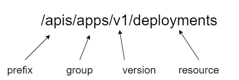

Kubernetes把其管理的资源均视为API对象，并对外提供`REST`风格的API来操纵这些对象。Kubernetes API由`kube-apiserver`组件提供，Kubernetes内部各组件与`kube-apiserver`通信也是使用API来驱动的，除此之外，命令行工具比如`kubectl`以及各种Kubernetes客户端程序均是使用API与Kubernetes通信。

## API格式
Kubernetes API格式为`prefix/group/version/resource`，比如表示`Deployment`资源列表的API为`/apis/apps/v1/deployments`，其中`apis`表示前缀，`apps`表示API组，`v1`表示API组的版本，`deployments`表示资源名称，如下图所示：



## API前缀
API中的前缀无疑会增加URL的长度，这不由得会让我们思考以下几个问题：
- 前缀存在的意义是什么呢？
- Kubernetes API都有哪些前缀？

要回答这个问题就要从API的定义来说起，API英文全称是`Application Programming Interface`，即应用程序编程接口。那么从广义上说，Kubernetes 的`kube-apiserver`组件对外暴露的所有端点都可以称作API，比如：
```
"/api/v1",
"/apis/admissionregistration.k8s.io",
"/apis/apps",
"/apis/authentication.k8s.io",
"/healthz",
"/livez",
"/metrics",
"/version"
```
应用程序可以使用这些接口来实现特定的功能，比如使用`/api/v1`或`apis/apps`接口来创建资源，使用`/healthz`来查询集群健康状态，所以这些接口都是API。

但是，往往我们所说的Kubernetes API是狭义上的概念，即专指那些表示Kubernetes资源的API，所以为了与其他API有所区分，Kubernetes特意加了`api`前缀，该前缀表示这些API用于管理Kubernetes资源。

用于管理Kubernetes资源的API前缀除了`api`外，还有`apis`，在Kubernetes早期的设计中，只有`api`前缀，后来为了引入API组的设计，又添加了`apis`前缀，简单地说，使用`api`前缀的API是Kubernetes最核心的一组API，而使用`apis`前缀的API是Kubernetes发展过程中引入的分组API。

## API组
前文提到Kubernetes早期只有以`api`为前缀的API，这些API提供了Kubernetes最核心的功能。随着Kubernetes的不断演进，Kubernetes需要引入更过的功能，也即需要提供更多的API，这不仅给Kubernetes带来了沉重的负担，也给用户带了困扰。

一方面，随着Kubernetes提供的功能增多，Kubernetes自身开发和维护难度越来越大，另一方面，用户往往只需要Kubernetes提供的部分功能。所以为了使Kubernetes更容易扩展和演进，同时可以让用户有选择性地开启和关闭非核心功能，Kubernetes设计者们提出了API分组的理念。

所谓API分组理念是指把Kubernetes的API按照功能分组，该理念被提出时Kubernetes已经有了以`api`为前缀的一组核心API，考虑到兼容策略，这组API不适宜修改，所以API分组实际上针对非核心的扩展API，后续新加的功能统一使用`apis`为前缀，并把API按组区分，部分API组如下所示：
```
"/apis/apps"
"/apis/autoscaling"
"/apis/rbac.authorization.k8s.io"
...
```
出现在前缀`apis`后面的就是API组，比如`apps`表示一组用于应用管理的API，`autoscaling`表示一组用于应用自动扩展的API，`rbac.authorization.k8s.io`表示一组用于基于角色控制的API。

把API分组最大的好处在于用户可以自由地开启和关闭相应的非核心功能。用户可以使用`kube-apiserver`组件提供的`--runtime-config`参数来显式地控制某项功能是否开启。比如：
```
--runtime-config=autoscaling/v1=false,rbac.authorization.k8s.io/v1=true
```
上面的配置显式地将`autoscaling`功能关闭，同时把`rbac.authorization.k8s.io`功能开启。需要说明的是，相当大一部分API组默认是开启的，比如默认情况下`rbac.authorization.k8s.io`这组API是开启的，这意味着上面配置中`rbac.authorization.k8s.io/v1=true`是多余的，出现在本例中仅用于说明API组可以显式地控制开启和关闭。

把API分组另一非常重要的好处在于，它可以给每组API按照功能成熟度划分成不同的版本，比如`v1alpha1`，`v1beta1`，`v1`等。

## API版本
每组API都有相应的版本表示其成熟度，比如`autoscaling`就有多个版本：
```
"/apis/autoscaling/v1",
"/apis/autoscaling/v2beta1",
"/apis/autoscaling/v2beta2",
```
为API提供版本并且多版本共存的意义在于为用户提供清晰的成熟度参考，比如版本名包含`alpha`表示该功能正在实验过程中，不推荐应用在生产环境中，因此Kubernetes默认不会开启这些功能，版本名包含`beta`表示该功能基本可用，希望用户尝试并提供反馈，因此Kubernetes往往默认启用这些功能，版本名为`vx`表示功能已固定，相应的API也不会再修改，用户可以放心使用。

为API分组同时为每个API提供多个版本，这允许每组功能可以不同的速度演进，而不必互相影响。

## 小结
了解一个应用的功能，从API入手往往能快速地掌握住该应用的概况，包括它是什么，它能用来做什么以及怎么使用它。本节简要地介绍了Kubernetes的API设计，借此读者可以从宏观上对Kubernetes API有个基本的了解，为将来详细了解每个功能点，也就是每个具体的API打下基础。

Kubernetes API的分组设计为其提供了无限的扩展能力，借此机制可以轻松地为Kubernetes提供扩展功能，用户不仅可以使用CRD（Custom Resource Definition）功能来提供新的API，还可以通过扩展apiserver来扩展功能。

前文也提到，提出API分组理念以前，Kubernetes就存在了以`api`为前缀的一组API，这了保持兼容性，这组核心API并没有划分到特定的组，它的API格式则是`prefix/version/resource`（少了group名字），比如`/api/v1/Pods`。通常我们在说API版本时往往是指`group/version`，即带上组名和版本，为了描述上的方便，社区开发者日常交流时往往称这组特别的API为`core`组。

## 延伸阅读
- 《The Kubernetes API》https://kubernetes.io/docs/concepts/overview/kubernetes-api/
- 《Supporting multiple API groups》 https://github.com/kubernetes/community/blob/master/contributors/design-proposals/api-machinery/api-group.md
