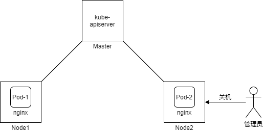
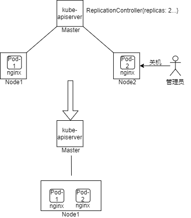

在介绍`ReplicationController`之前，我们先思考一下下图所示的场景，Kubernetes集群包含2个Node，每个Node上均运行一个同类型的Pod来做负载均衡，如果其中某个Node被管理员强制关机或者Node意外宕机时，会发生什么呢？



由于Pod被调度到某个Node后就与Node绑定，当Node宕机后，Node中的所有Pod也都停止运行。
上图所示场景中，Node2被关闭后，相应的Pod-2也会停止，Pod-2并不会重新被调度到Node1。

实际应用场景中，维持稳定的Pod副本数是非常必要的，因此Kubernetes引入了`ReplicationController`。

## 工作机制
`ReplicationController`用于定义指定Pod的副本数，与创建多个Pod相比，它可以保证Pod意外终止后，集群中仍会有指定个数的Pod副本在运行。运行于`kube-controller-manager`组件中的`ReplicationController`控制器（控制器和资源名相同）会监控集群中Pod的副本数：

- 如果Pod数量已经超出预期，那么ReplicationController将会删除部分Pod，使Pod数量符合预期。
- 如果Pod数量低于预期，那么ReplicationController将会创建新的Pod，使用Pod数量符合预期。

`ReplicationController`控制器会时刻监控Pod的副本数量，一旦发现Pod数量不符合预期（Pod数量过多或过少），均会通过增加或删除Pod的手段来让Pod维持在预期数量。

`ReplicationController`控制器更像是一个Pod监管者，它监管的是整个集群范围的Pod。在本节开头中所引用的场景中，如果使用`ReplicationController`创建两个Pod的副本，当其中一个Pod意外终止后，新的Pod会被创建出来，从而保证集群中仍有两个副本在运行，整体工作机制如下图所示：



通过示意图可以看到，通过`ReplicationController`创建两个Pod情况下，当Node2被关闭后，运行于其上的Pod被重新调度到Node1中运行，集群中总的Pod数始终保持在2个。

## ReplicationController配置
一个简单的`ReplicationController`资源配置如下所示：
```
apiVersion: v1
kind: ReplicationController
metadata:
  name: replication-controller-runs-pod
spec:
  replicas: 3
  selector:
    app: nginx
  template:
    metadata:
      labels:
        app: nginx
    spec:
      containers:
      - name: nginx
        image: nginx:1.19.0
```
其中有三个关键的项：
- `spec.replicas`指定了期望的Pod副本数；
- `spec.selector`指定了Selector，`ReplicationController`正是通过该Selector来查找Pod对象；
- `spec.template`指定了Pod的模版，当`ReplicationController`发现Pod数量低于预期时将使用该模版创建新的Pod。

### Pod 模板
Pod模版用于Kubernetes内部动态地创建Pod，它广泛应用于各种控制器中，包括本节中介绍的`ReplicationController`，以及后续将要介绍的`Deployments`、`Jobs`和`DaemonSets`等等。

从数据结构上看，Pod模版（PodTemplateSpec）可以理解为简化版的Pod，它只保留了Pod的Metadata和Spec，如下所示：
```
type PodTemplateSpec struct {
	// Metadata of the pods created from this template.
	// +optional
	metav1.ObjectMeta

	// Spec defines the behavior of a pod.
	// +optional
	Spec PodSpec
}
```
## ReplicationController小结
`ReplicationController`设计初衷是维持集群中指定类型Pod的副本数，但它只支持等值Selector，不支持基于集合的Selector。为了不违背API兼容性原则，Kubernetes不得已提供了另一种制器`ReplicaSet`来替换它。

所以，实际场景中几乎不会用到`ReplicationController`，虽然它是一个稳定的API。

## 延伸阅读
- 《Pod templates》https://kubernetes.io/docs/concepts/workloads/pods/pod-overview/#pod-templates
- 《ReplicationController》https://kubernetes.io/docs/concepts/workloads/controllers/replicationcontroller/