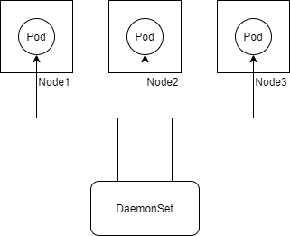

`DaemonSet`是一种面向特定应用场景的`Pod`控制器，尽管它也可以管理`Pod`的多个副本，但它主要用于保证一个`Node`上只运行一个`Pod`的场景，如下图所示：



`DaemonSet`可以确保一个`Node`上最多只运行一个`Pod`副本，进一步说，`DaemonSet`可以选择特定类型的`Node`来部署`Pod`。此处，当选定类型的`Node`加入集群时，该`Node`会自动运行一个新的`Pod`副本，并且当该`Node`被删除时，相应的`Pod`也会被删除，而不会在其他`Node`上重建。

## 应用场景
`DaemonSet`可以确保每个工作节点上最多运行一个应用副本，这个应用副本类似于Linux操作系统中的`daemon`进程，这也正是`DaemonSet`名称的由来。

`DaemonSet`通常用于管理那些执行系统级的应用，比如：
- 每个工作节点运行一个存储服务，供该工作节点上其他应用使用；
- 每个工作节点运行一个日志收集服务，用于收集该节点上的运行日志；
- 每个工作节点运行一个监控指标收集服务，用于提供该节点的监控信息；

## 配置格式
我们先看一个简单的`DaemonSet`配置：
```
apiVersion: apps/v1
kind: DaemonSet
metadata:
  name: nginx-daemonset
  labels:
    app: nginx
spec:
  selector:
    matchLabels:
      app: nginx
  template:
    metadata:
      labels:
        app: nginx
    spec:
      containers:
        - name: nginx
          image: nginx:1.19.0
```
初步看，这份配置跟`Deployment`基本类似，唯一一个显著的差异是`DaemonSet`不需要指定副本数，因为它的副本数取决于工作节点数。

`DaemonSet`配置中`spec.selector`和`spec.template`作用我们已在介绍`Deployment`时介绍过，在此不再赘述。