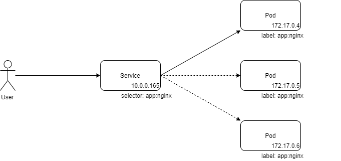

`Service`是一种抽像资源，用于暴露运行在`Pod`中的服务并提供一定的负载均衡能力。

## Service的出现背景
通常，我们希望把服务部署在`Pod`中，往往会通过`Pod`控制器（如`Deployment`）来创建并管理多个`Pod`副本，例如，我们通过`Deployment`创建了3个`Pod`副本，每个`Pod`中均运行一个`nginx`服务，如下所示：
```
[root@ecs-d8b6 manifests]# kubectl get pods -o wide
NAME                               READY   STATUS    RESTARTS   AGE   IP           NODE        NOMINATED NODE   READINESS GATES
nginx-deployment-5f67bd6bb-bvx2w   1/1     Running   0          10s   172.17.0.5   127.0.0.1   <none>           <none>
nginx-deployment-5f67bd6bb-g9kkp   1/1     Running   0          10s   172.17.0.4   127.0.0.1   <none>           <none>
nginx-deployment-5f67bd6bb-sr2w4   1/1     Running   0          10s   172.17.0.6   127.0.0.1   <none>           <none>
```
`Kubernetes`会为每个`Pod`分配一个IP地址，`Pod`使用该IP地址与外界通信，在上面的例子中三个`Pod`的IP地址分别为`172.17.0.5`、`172.17.0.4`和`172.17.0.6`。用户或集群中的其他`Pod`都可以使用这些IP地址访问`nginx`服务，如下所示：
```
[root@ecs-d8b6 manifests]# curl 172.17.0.4
<!DOCTYPE html>
<html>
<head>
...
</head>
<body>
<h1>Welcome to nginx!</h1>
...
</body>
</html>
```

这样的部署方式仅仅可以保证基础的服务能力，从实际的用户体验角度来看，存在一些无法回避的问题。

首先，`Pod`的IP地址是随机分配的，其他`Pod`无法提前知晓服务的IP地址。

其次，`Pod`是一种“易逝”的资源，它随时都有可能被重新创建或被调度到其他节点，而每次都会获得一个新的随机IP地址。

再次，多个`Pod`副本之间没有联系，如果用户需要为服务提供负载均衡的能力，用户需要动态地管理这些`Pod`并处理流量分发。

`Service`正是为了解决这些痛点而推出的一种解决方案，它管理一组`Pod`副本，为这些副本提供可靠的访问入口以及负载均衡能力。

## Service配置
像其他对象（如`Pod`）一样，`Service`也是一个REST对象，你可以通过相应的API或配置文件来创建`Service`对象，一个简单的`Service`配置文件如下所示：
```
apiVersion: v1
kind: Service
metadata:
  name: nginx-service
spec:
  selector:
    app: nginx
  ports:
    - protocol: TCP
      port: 80
      targetPort: 80
```
这份配置将创建一个名为`nginx-service`的`Service`对象，其主要配置如下：
- `spec.selector`：指定`Pod`选择器，该`Service`将查找包含`app: nginx`标签的`Pod`作为流量分发对象；
- `spec.ports`：该`Service`对外暴露的端口列表，支持暴露多个端口；
- `spec.ports.protocol`：该端口对应的IP协议，支持`TCP`、`UDP`和`SCTP`;
- `spec.ports.port`：该端口对外暴露的端口号；
- `spec.ports.targetPort`：后端`Pod`暴露的端口；

简单地说，`Service`通过`spec.selector`来查找`Pod`，并把这些`Pod`提供的服务“聚合”起来，对外提供一个统一入口。创建`Service`对象时，`Kubernetes`默认会给`Service`分配一个IP（称为`Cluster IP`），例如`10.0.0.165`，`Service`通过该IP对外提供服务，当请求流量到来时，再把流量转发到后端的`Pod`，并提供一定的负载均衡能力。整体工作流程如下所示：



访问`Service`的Cluster IP，效果与直接访问`Pod`的IP地址一样，但使用`Service`可以屏蔽后端`Pod`细节，对外提供固定的访问入口，当后端的`Pod`有变动时，`Service`会自动更新转发列表。