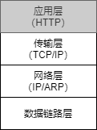
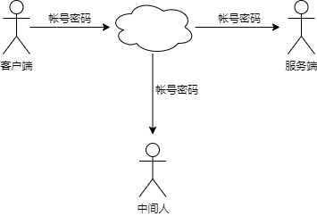
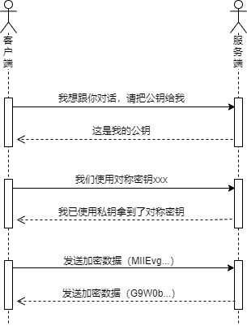
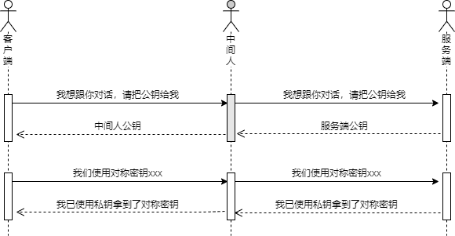
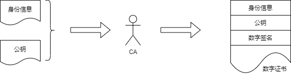
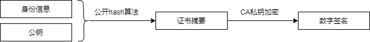
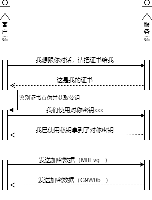

使用HTTPS通信时，需要服务端提供证书，比如使用浏览器访问网站，浏览器就会验证网站的证书以确保网站是安全可靠的。在Web应用系统中，客户端访问服务端时，服务端也可以要求客户端提供证书，以确保客户端是合法的。

本节介绍证书以及与其相关的公钥、私钥和签名等基础概念，希望通过本节的学习能够回答以下问题：
- 什么是非对称加密？
- 什么是公钥和私钥？
- 什么是数字签名？
- 什么是数字证书？

## HTTP为什么不安全
HTTP协议位于TCP/IP四层模型中的应用层，其本身并没有提供任何数据加密机制。

客户端和服务端的通信全部是明文的，假如有中间人抓取网络包就会造成信息泄露，甚至还会篡改数据以及假冒服务器身份达到钓鱼的目的，如下图所示：

## HTTPS
HTTPS协议正是为了解决HTTP安全问题而推出的。为了增强数据的保密性，使用HTTPS通信时会对数据加密，加密算法可分为对称加密和非对称加密两类。

#### 对称加密
对称加密算法中数据加密和解密都使用同一个密码，这样即便数据被中间人窃取由于没有密码也不能解密。

在一些抗战影视作品中，常见到使用电台进行通信，这就是典型的对称加密场景。作战指令通过`密码本`翻译成一串适合电台发送的编码，接收方根据`密码本`将编码翻译出原始的作战指令。这个过程中即便敌方窃取到通过电台发送的编码，也无法破解出其中的内容，但是如果`密码本`被敌方获取，那么信息就会被破解。

在网络中，如果客户端和服务端也使用对称加密算法对数据加密，双方首先需要协商出一个密码，后续数据都使用该密码加密和解密，这在一定程度上可以提高数据安全性，但协商密码的过程仍然为明文，中间人还是可以获取密码，从而轻松破解信息。

那么，如何保证密码协商过程也是安全的呢？那就需要使用非对称加密算法了。

#### 非对称加密
非对称加密算法中需要使用一对密钥，即公钥和私钥。使用公钥加密的数据需要使用对应的私钥解密，使用私钥加密的数据需要使用对应的公钥解密。

网络通信时，服务端将公钥发送给客户端，客户端使用公钥加密数据后发送给服务端，服务端接收数据后使用私钥解密，在这个过程中，即便中间人窃取了数据，由于没有服务端的私钥仍然不能破解，这样就保证了客户端发送到服务端的数据是安全的。

考虑到服务端的公钥是随网络发送的，中间人也能拿到服务端的公钥，所以中间人仍然可以破解服务端发往客户端的数据，因此服务端在向客户端发送数据时不能使用私钥加密，只能使用客户端协商的对称密钥加密。另外，对称加密算法在效率上也远远高于非对称加密算法。

客户端和服务端使用非对称加密算法保证了协商对称密钥的过程是安全的，一旦有了对称密钥，后续的通信就可以使用对称密钥来加密数据，整个过程如下图所示：

然而，这种通信过程仍然有个漏洞，中间人有可能截获服务端的公钥，然后替换成中间人的公钥，中间人就可以使用其私钥破解协商的对称密钥，整个过程如下图所示：

这个漏洞的核心是客户端不知道收到的服务端的公钥是真的还是被篡改过的。在现实生活中，我们收到一份文件，可能也不能辨别真假，但是如果它加盖了政府部门的公章，就比较容易辨别了，因为我们可以到政府部门核对真伪。在使用HTTPS协议通信时，证书的作用正是证明公钥的合法性。

#### 证书

在密码学领域，证书是一种证明公钥归属的电子文档，有时也被称为数字证书。
证书包含公钥信息、公钥所有者信息以及权威机构的签名。

权威CA（ Certificate Authority）机构可以颁发证书，服务端申请证书时需要提供自身身份信息及公钥。
对于网站用的证书而言，自身身份信息包括网站域名、公司名称、城市、省份和国家，公钥是网站管理员事先生成的。

CA机构签发证书过程如下所示：

证书中的数字签名类似于日常生活中政府的公章，是鉴别证书真伪的关键。

CA机制生成数字签名时，先使用公开的哈希算法对身份信息和公钥进行哈希运算得到证书的摘要信息，然后再使用CA机制自身的私钥对摘要信息进行加密，如下图所示：

之所以说数字签名是鉴别证书真伪的关键，是因为客户端可以使用CA机构的公钥解密数字签名得到证书摘要，客户端还可以从证书中提取身份信息和公钥，并对其进行哈希运算再得到一份证书摘要，如果两个证书摘要一致，说明证书内容没有被篡改过。

如果身份信息和公钥只要被篡改，证书摘要就会变化，而如果数字签名被篡改就不能使用CA机构的公钥解密。

综上，证书是用来证明公钥真实可信的，这就解决了前面提到的客户端无法辨别公钥真伪的问题。

客户端和服务端协商对称密钥时，不再直接给客户端发送公钥，而是发送包含公钥的证书，客户端先验证证书的真伪，证书为真时才会从证书中提取公钥，完整的通信过程如下所示：

## 小结
正所谓道高一尺，魔高一丈，众多科学家努力提升网络安全性的同时，黑客入侵和攻击技术也在不断地演进，当前使用的HTTPS协议也不是绝对安全的。

比如浏览器为了支持HTTPS协议，会预安装各个权威CA机构的公钥证书，用于验证服务端的证书，如果发现钓鱼网站，浏览器会给出安全提醒甚至拒绝访问。但如果浏览器误装了黑客的证书，钓鱼网站就会骗过浏览器，从而窃取用户隐私数据。

参考文档：
- 《Public key certificate》https://en.wikipedia.org/wiki/Public_key_certificate
- 《Certificate signing request》https://en.wikipedia.org/wiki/Certificate_signing_request