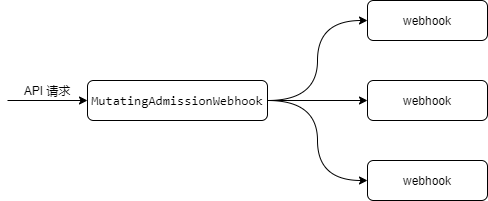

`MutatingAdmissionWebhook`是一款系统内置且默认启用的准入控制器插件，它在`kube-apiserver`审查请求（Mutating admission）阶段被调用，用于审查请求。

与其他准备控制器插件不同的是，`MutatingAdmissionWebhook`本身并不直接审查请求，而是将任务转发给相应的`webhook`（多个`webhook`串行调用），如果任何一个`webhook`返回失败，`MutatingAdmissionWebhook`将会立即拒绝请求。`MutatingAdmissionWebhook` 与`webhook`的关系如下图所示：

`webhook`通常是一个专门负责审查资源对象的web服务，`webhook`根据是否会修改请求分为`Mutating`（修改型）和`Validating`（校验型）两类。`MutatingAdmissionWebhook`负责管理并调用`Mutating`类型的`webhook`，该类型`webhook`通过`MutatingWebhookConfiguration`对象注册到系统中，`MutatingWebhookConfiguration`对象中描述了`webhook`的服务地址、关心的资源对象类型等信息。`MutatingAdmissionWebhook`正是根据`MutatingWebhookConfiguration`对象来获取`webhook`列表，并在API 请求来到时筛选并调用`webhook`。关于`MutatingWebhookConfiguration`对象的更多信息将在后续章节展开介绍。

`MutatingAdmissionWebhook`是`Kubernetes`一个重要扩展机制，常用于对扩展的`CRD`(CustomResourceDefination)对象进行审查和改写，当然它也可以用于`Kubernetes`原生资源对象，比如当`Pod`创建时自动添加`label`。
